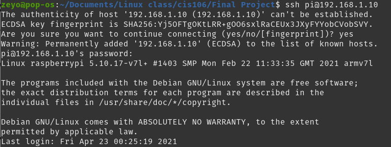
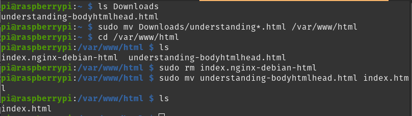
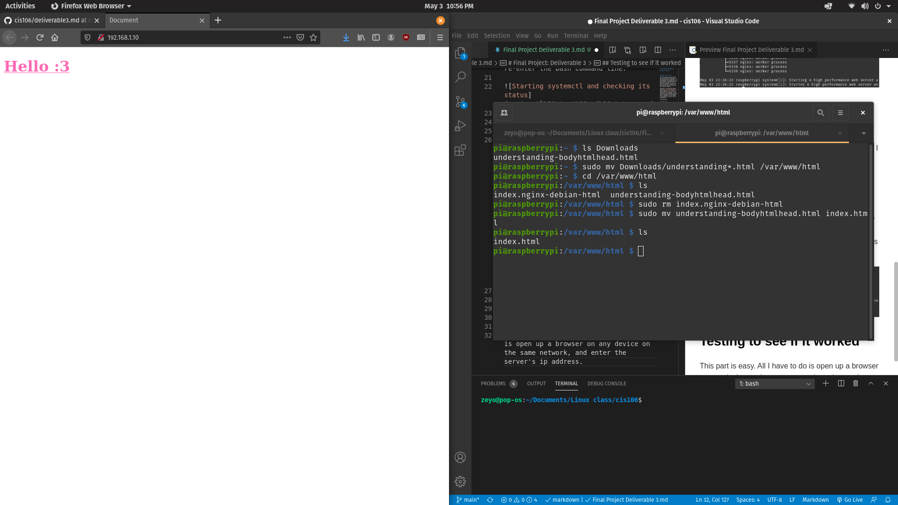
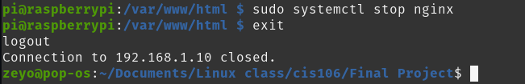

# Final Project: Deliverable 3

## Table of Contents

- [Final Project: Deliverable 3](#final-project-deliverable-3)
  - [Table of Contents](#table-of-contents)
  - [SSHing into the server](#sshing-into-the-server)
  - [Initial setup](#initial-setup)
  - [Setting up my website](#setting-up-my-website)
  - [Testing to see if it worked](#testing-to-see-if-it-worked)
  - [Turning nginx back off, and exiting the server terminal](#turning-nginx-back-off-and-exiting-the-server-terminal)

## SSHing into the server

The first thing you want to figure out is the server's ip address. If you don't have this written down, you unfortunately need to use manual input/output via a keyboard and mouse and a monitor to open the server's terminal up and type `hostname -I`, and write it down so you don't have to do it again later. Once you've done that, you can work fully from your preferred computer.

The syntax for sshing into another machine is `ssh username@ip_address`. For the purposes of my project, I'm doing `pi@192.168.1.10`, as that's the username and ip address for my raspberry pi. As requested, I would enter my password, and the green text next to my directory would change from my computer's user to the user of the server. In my case, this is pi@raspberrypi.

## Initial setup

First off, I'd want to nginx with `sudo apt install nginx`. I've already done this though, and that's kinda a one time thing, so I'm afraid I can't give any demonstrations there.

Once I've done that, I'd use `sudo systemctl start nginx` to start it up, and then `sudo systemctl status nginx` to make sure it's running. The green "active (running)" text means it's up and running, so I know it's at least working. I'd then simply enter `q` to re-enter the bash command line.

## Setting up my website

I had initially named the website I'm putting up "understanding-bodyhtmlhead.html" for practice, and I want to use that as my website now. The first thing I want to do is to move it to the `/var/www/html` directory. There should already be a default website here. What I want to do is delete that, and rename the initial site I want to display to `index.html`. As I'm working with a root directory, this would all be done with `sudo`.

## Testing to see if it worked

This part is easy. All I have to do is open up a browser on any device on the same network, and enter the server's ip address.

## Turning nginx back off, and exiting the server terminal

Turning nginx back off is done simply through `sudo systemctl stop nginx`. Exiting the server is done the same as one would exit a regular terminal, with the `exit` command.

