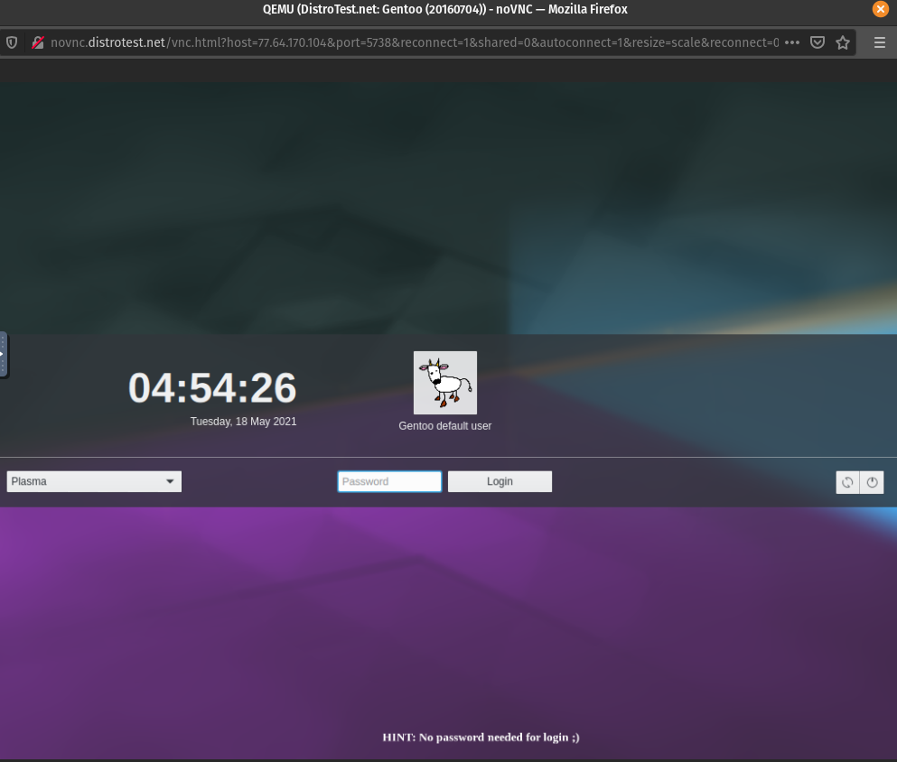
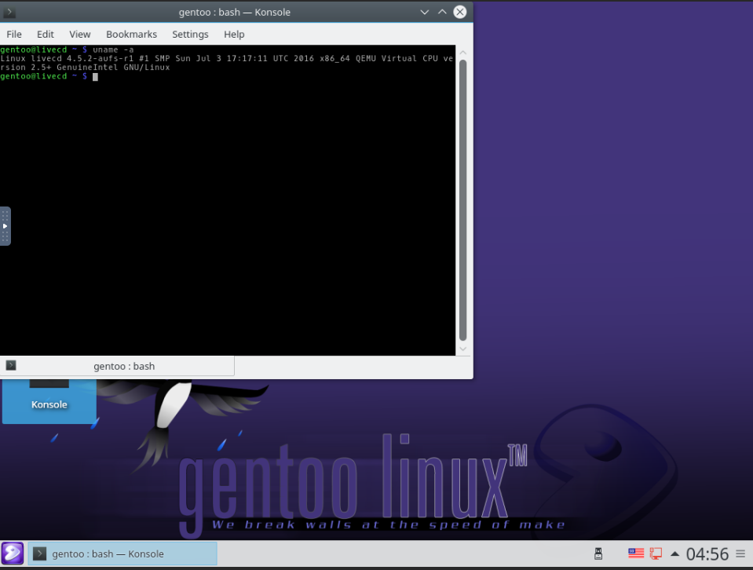

# Lab 1: Distrowatch

## Question 1:

1. Linux
2. Debian
3. armhf, ppc64el, s390x, x86_64
4. Active
5. https://www.ubuntu.com/

## Question 2:

1. Name: SME Server
Type: Linux
2. Fedora, CentOS
3. i686, x86_64
4. Active
5. http://www.smeserver.org/

## Question 3:

1. Gentoo Linux
2. USA
3. Independent
4. Desktop, Server, Source-based
5. i486, i586, i686, alpha, arm, hppa, ia64, mips, powerpc, ppc64, sparc64

## Question 4:

1. 
- Kali Linux
- http://www.kali.org/
- Enlightenment, GNOME, KDE Plasma, LXDE, MATE, Xfce
2. 
- Trisquel GNU/Linux
- http://trisquel.info/
- KDE Plasma, LXDE, MATE
3. 
- Linux Mint
- https://linuxmint.com/
- Cinnamon, MATE, Xfce

## Question 5:

Gamer-os kinda reminds me of Steam-OS. Actually, it might even be a spiritual successor, considering steam-os isn't updated anymore. It's essentially a linux distribution for playing games (mostly Steam games) like it's a regular game console. Kinda pointless in my opinion, cause everything you can do with this, you can do just by opening Big Picture Mode in Steam. But I guess if you REALLY wanna play PC games without feeling like you're playing on a PC, this is the way to go. At least it claims to allow you to play non-steam games too, so that makes it an upgrade from Steam-OS.

## Question 6: 

