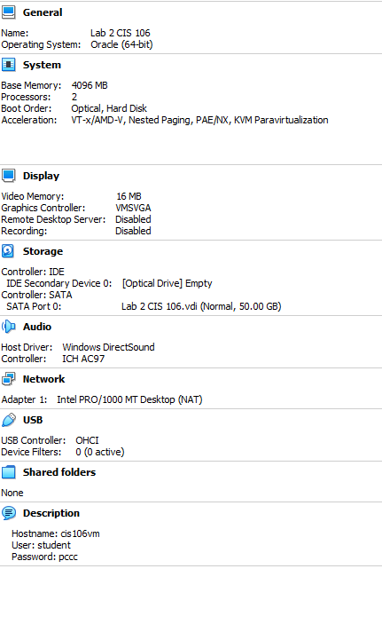
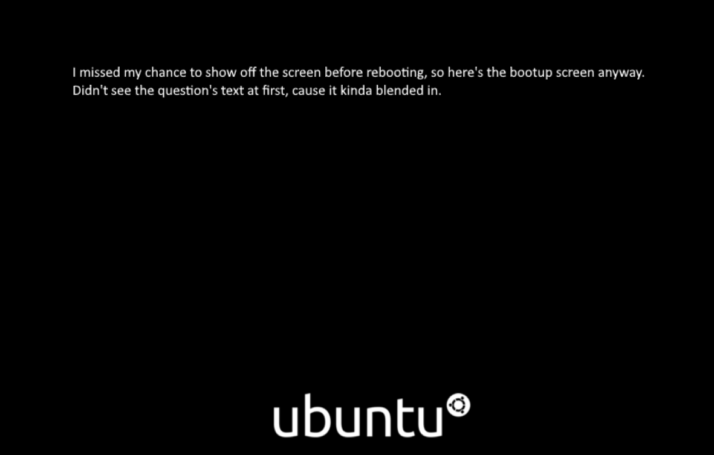
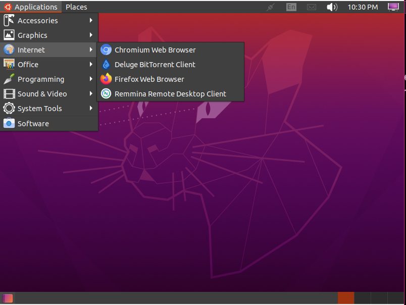
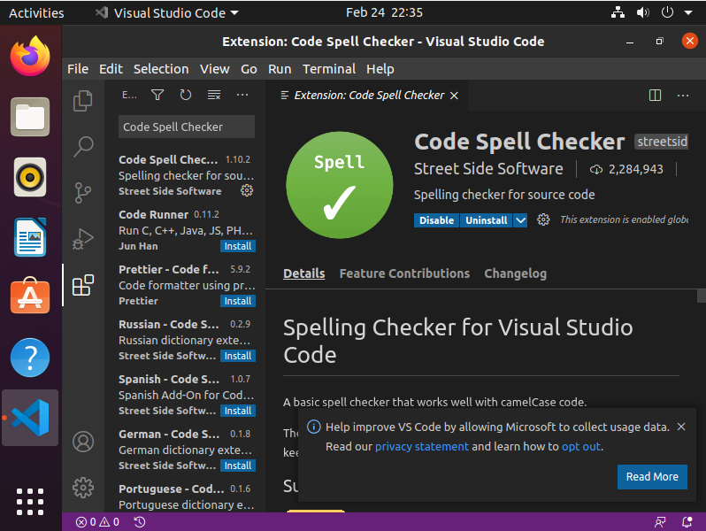

# Lab 2: Installing Ubuntu 20.04 in VirtualBox

## Question 2:

## Question3:

## Question 4:

## Question 5:

I decided to switch back to the stock desktop environment. Sorry if that's a problem. The sidebar's a tad intrusive, but my first Linux OS was Pop_OS, so I'm more used to this setup.
