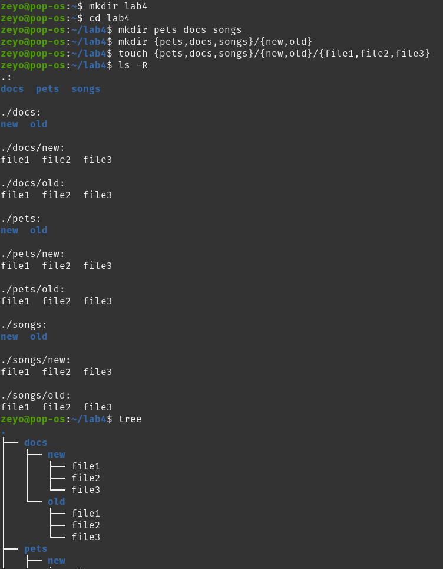
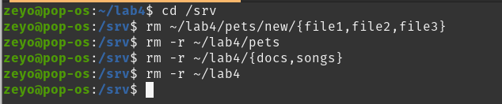
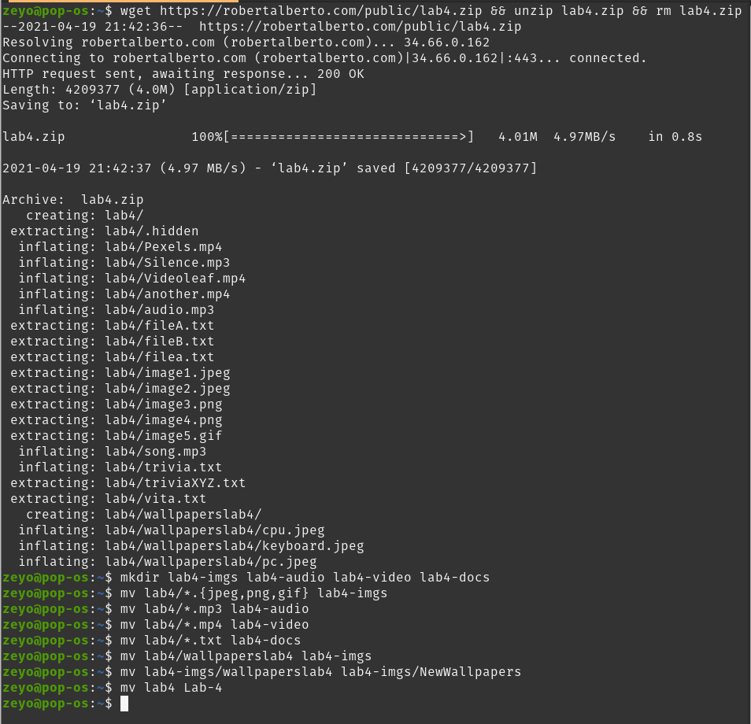
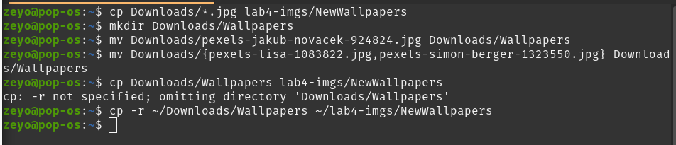

# Lab 4

##Disclaimer

I'm in the process of setting up my ubuntu environment all over again, which takes an eternity and a half, so I'm gonna do this on my pop_os distro. Considering that pop_os is ubuntu based, I don't anticipate there being any problems with this.

##Question 1: Creating Files and Directories

##Question 2: Removing Files and Directories

##Question 3: Moving Files and Directories

Sorry I missed the instruction that said to move it to Pictures, not lab4-imgs. I REALLY would rather not have to re-type all of that though, and this is easier on the cleanup anyway, so I'm just gonna work with it.

##Question 4: Copying Files and Directories

##Question 5: Getting Help

Oh, wait, I don't have to put anything for this one. And I've already practiced the man command plenty
