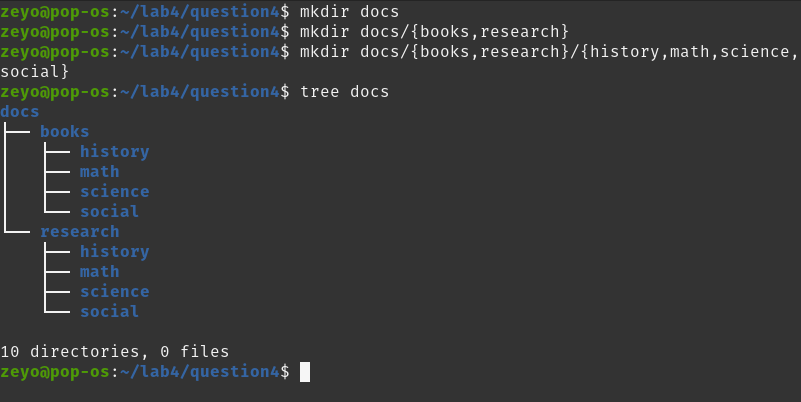

# Lab 4.2

God, I forgot there was another

## Question 1: Using the * wildcard

## Question 2: Using the ? wildcard

## Question 3: Using the [] wildcard

## Question 4: Using the brace expansion

