# Lab 5

## Question 1

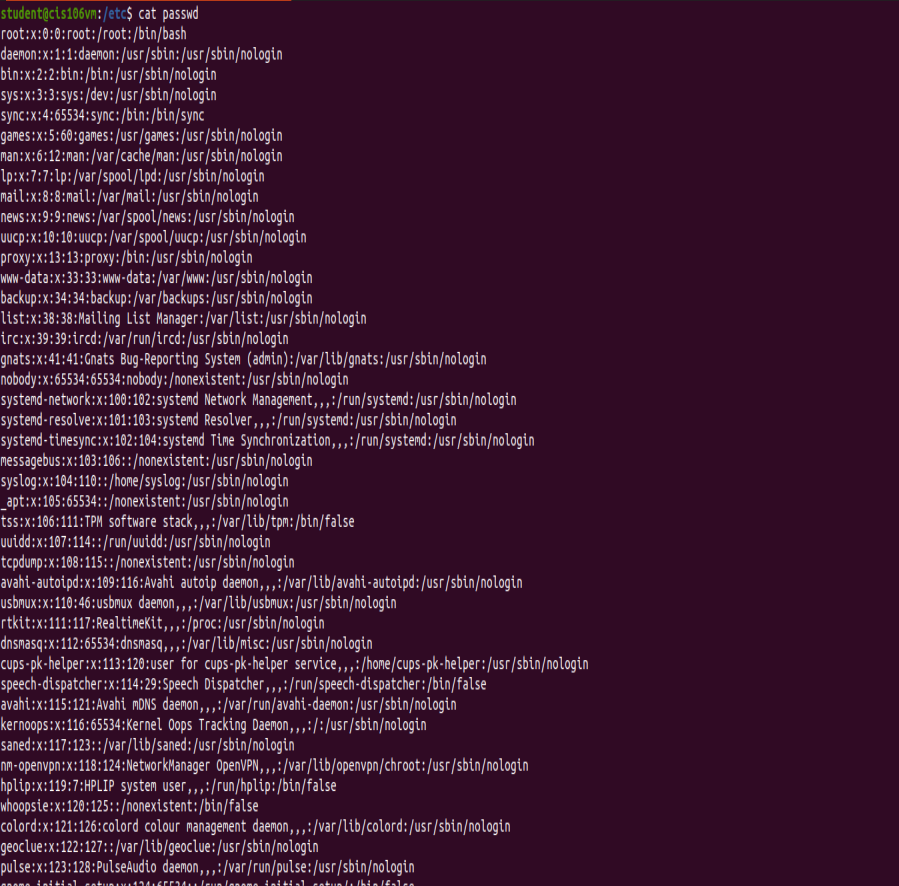
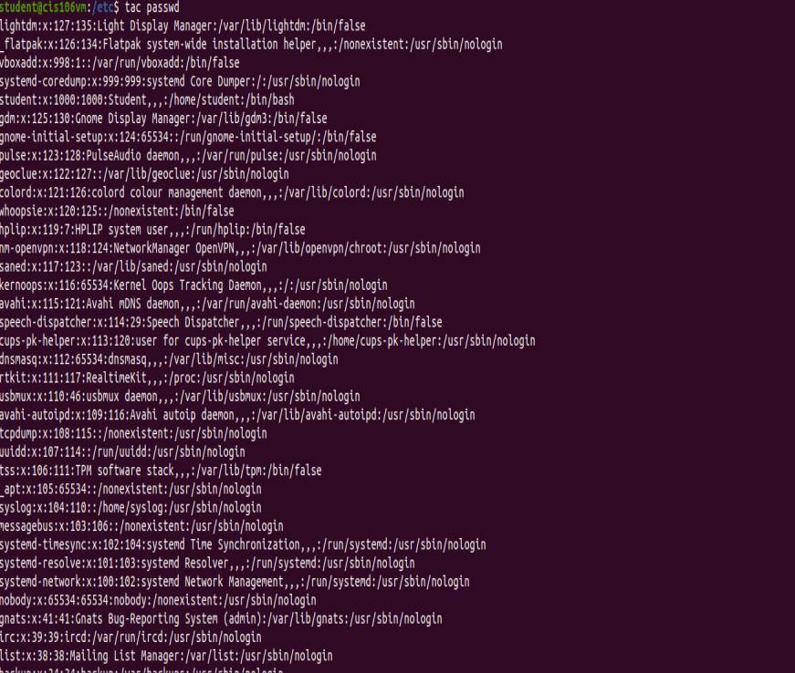
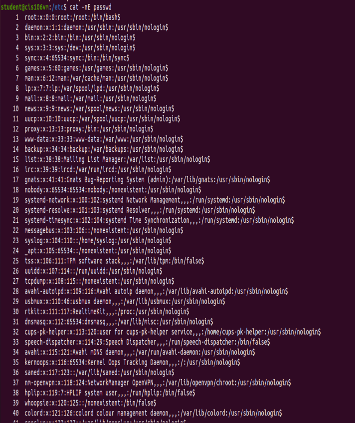
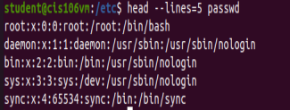
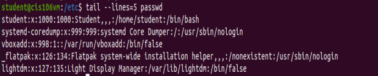

## Question 2

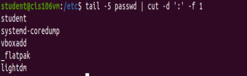

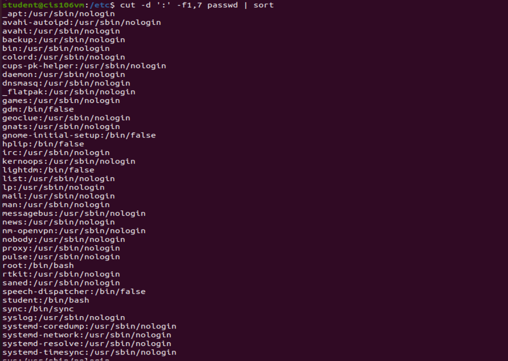

## Question 3

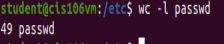

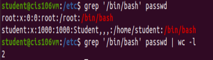
Note: For question 3.3, either of these is fine. If there were enough that counting them manually would be tedious, the latter is preferable.
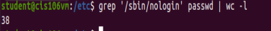

## Question 4

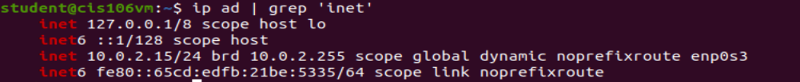
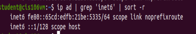
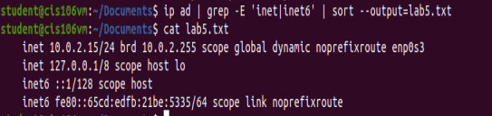

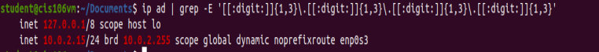

## Question 5

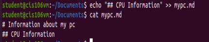
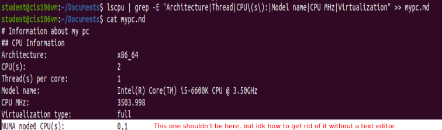
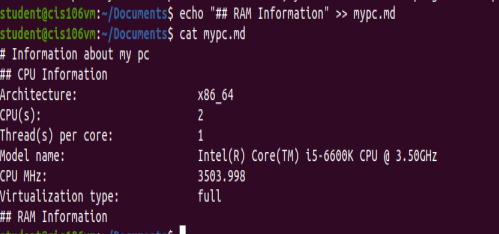
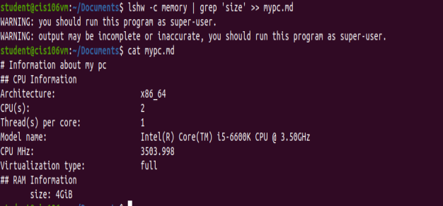
