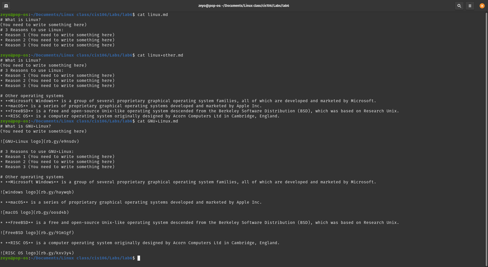

#Lab 6

##Question 1:

Uhhhh... Looks like I don't actually have to put anything for this one.

##Question 2:

I think I'm supposed to include the files I'm editing as well, so I'm gonna do this in my pop_os terminal this time. They should be in the same directory as this file.

