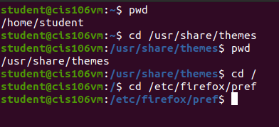
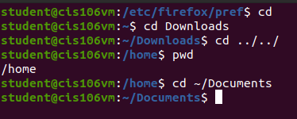
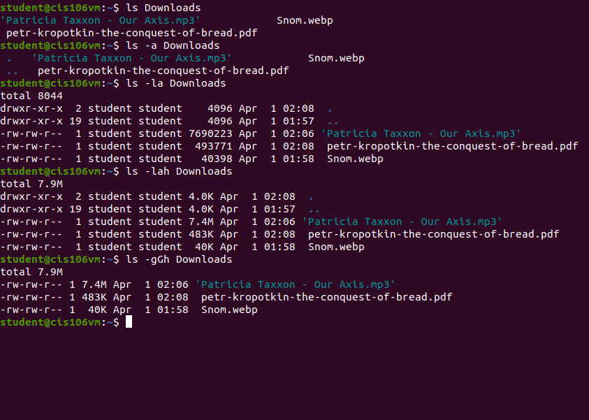
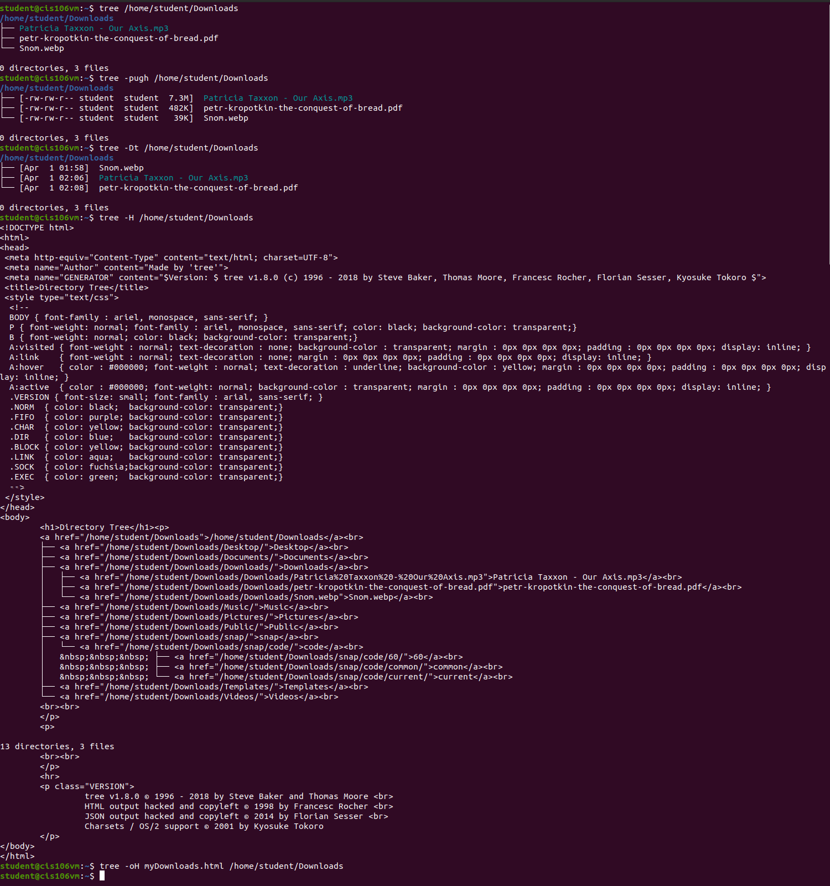
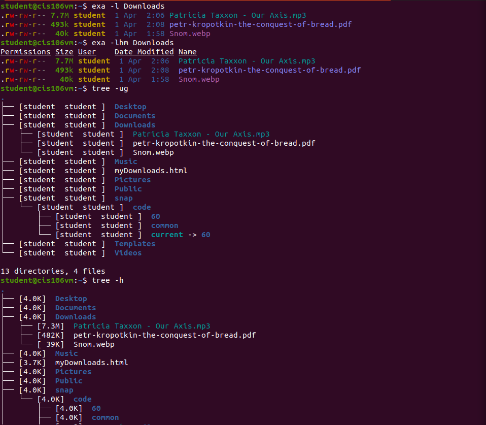

# Lab 3 | Installing software and navigating the file system | Answers
Assignment description [here](https://raw.githubusercontent.com/ra559/cis106/main/labs/lab3.md)

## Question 1
1. Which command did you use to search for the themes and to install them?

```
apt-cache search theme
sudo apt-get install yaru-theme-gtk
sudo apt-get install yaru-theme-icon
```
Sorry if that was a tad specific. That's just the most common way I've found in the past. That, and `snap`, I guess.

2. Which commands did you use to find and install the web browser?

```
apt-cache search tor
sudo apt-get install torbrowser-launcher
```

3.1 What is the name of the package?

xracer

3.2 What dependencies are needed in order to install the package? (you can either take a screenshot of the terminal or copy and paste from the terminal)

```
netpbm, freeglut3, libc6 (>= 2.14), libgl1, libglu1-mesa | libglu1, libjpeg8 (>= 8c), libx11-6
```

3.3 How much disk space will the package utilize after installation?
 
 861 kB

## Question 2
1. Start a terminal. What is your present working directory?

`/home/student`

2. Change your present working directory to `/usr/share/themes`

3. What is your present working directory?

`/usr/share/themes`

4. Change your present working directory to the root of the filesystem

5. Change your present working directory to `/etc/firefox/pref`



6. Clear your terminal window. Change the working directory to YOUR home directory.

7. Change the working directory to the Downloads directory.

8. Go back 2 directories.

9. Where are you now?

`/home`

10. Change the working directory to the Documents directory.



## Question 3



## Question 4



## Question 5

